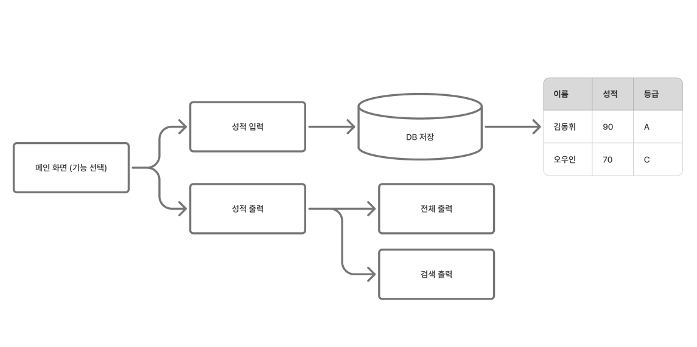

# I. C언어 과제
**과제 주제**: If~Else 구조와 Switch Case 문을 이용하여 성적처리를 구하는 프로그램을 작성하시오.  
(90점 이상 A, 80점 이상 B, 70점 이상 C, 60점 이상 D, 나머지 F)

링크:
https://docs.google.com/document/d/1Ut6MVODsMBTqHKB4s5hdnGaI3Yp_6rXGDMvWAA2uoJE/edit?usp=sharing

## A. 요구사항 도출
### 가. 브레인 스토밍
- 성적 구분
- 성적 목 데이터베이스
- 성적 입력 기능
- 성적 조건 검색 기능
- 성적 전체 검색 기능

### 나. 다이어그램 표현



### 다. 제약사항
- DB 서버 컴퓨터에 깔기 싫음  
  - 도커 활용
    - Docker Compose 수정

## DB 공부
- 오랜만에 해서 들어가는 명령어가 기억이 안남
```
psql -U user -d fridge
```

## 트러블 슈팅
> gcc main.c -o app.exe
- 이 명령어를 사용할 때, 안되는 이유는 컴파일 옵션 문제이다.

> gcc main.c -I/usr/include/postgresql -lpq -o app
- 그래서 헤더 폴더 위치를 알려줘야함. 왜 알려줘야 하냐?

postgres는 헤더 파일을 설치하는 곳이 따로 있는데, gcc는 `/usr/include` 만 찾음

## B. 코드
GPT 딸깍