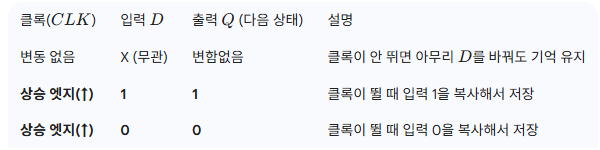
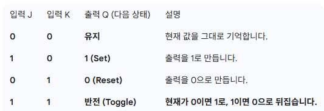
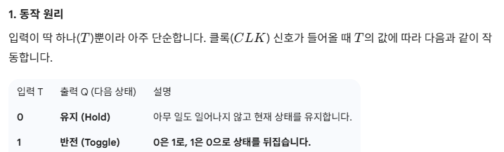

# 5주차 1교시: 순서논리회로의 개념과 설계
## Z26. 순서논리회로의 개념
### (1) 조합논리회로 (combinational logic circuit)
- 이전 입력 값에 관계없이 현재 입력 값에 띠리 츨력이 결정

### (2) 순서논리회로 (sequential logic circuit)
- 현재의 입력 값과 이전 출력 상태에 따라 출력 값이 결정

조합 논리 회로, 입력과 출력  
현재상태 - 다음상태 - 메모리 소자 - 클록 펄스

### (3) 순서 논리 회로의 출력은 외부에서 들어온 입력과 이전 출력 상태에 따라 결정
- 동작은 클록 펄스가 들어옹ㄹ 때마다 반복해서 일어남

### (4) 기억 기능 
- 플립플롭, 카운터, 레지스터 등

- 플립플롭 동작 파형 -> 에지 트리거
- 클록 펄스(구형파)로 에지 트리거 생성

> 상승 에지 트리거
>- 클록 펄스(구형파)로 에지 트리거 생성

> 하강 에지 트리거
>- 

**(4) 플립플롭의 특징**
- 1비트의 정보를 기억할 수 있는 기억 소자
- 제어 입력 -> 클록 펄스
- 출력 2개
- 플립플롭은 SRAM의 구성요소로도 사용

## A1. 플립플롭

1. **S (Set: 설정)의미**: "출력을 **1(High)**로 만들어라"는 뜻입니다.  
동작: S에 신호를 주면(1), 이전 상태가 무엇이었든 상관없이 출력 $Q$는 1이 됩니다. 전등 스위치를 켜는 동작과 같습니다.  
2. **R (Reset: 리셋)의미**: "출력을 **0(Low)**으로 되돌려라"는 뜻입니다.  
동작: R에 신호를 주면(1), 출력 $Q$는 0이 됩니다. 기기를 초기화하거나 전등 스위치를 끄는 동작과 같습니다.  

### (1) SR 래치
#### ㄱ. NOR 게이트로 구성
#### ㄴ. NAND 게이트로 구성
### (2) SR 플립플롭
- CP에 의해서만 동작하는 SR 래치
- CP의 에지 트리거 신호가 입력된 경우

**2. 핵심 특징**
- **상태 유지**: 입력이 둘 다 0일 때 이전의 값을 기억하고 있다는 점이 일반적인 게이트(AND, OR 등)와의 차이점입니다.
- **결함(부정 상태)**: S와 R에 동시에 1을 입력하면 출력값이 예측 불가능하거나 논리적으로 모순된 상태가 됩니다. 이를 보완하기 위해 만든 것이 JK 플립플롭입니다.
- **구성**: 보통 NOR 게이트나 NAND 게이트 두 개를 교차 피드백(Feedback) 구조로 연결하여 만듭니다.

### (3) D 플립플롭
- SR 플립플롭에서 (S=R=1, 부정)을 제거하는 한가지 방법
- 입력신호 D가 CP에 그대로 전달됨  

**하는 일**: "클록이 뛸 때의 $D$ 값을 딱 찍어서 다음 클록이 올 때까지 보관한다."  
**장점**: SR 플립플롭처럼 금지된 입력 때문에 고민할 필요가 없습니다.  
**용도**: 컴퓨터의 메모리(RAM), CPU 내의 레지스터, 데이터 전송 시 박자를 맞추는 용도로 가장 많이 사용됩니다.  

### (4) JK 플립플롭
- SR 플립플롭에서 불안정한 상태 개선
- S=1, R=1에서도 작동함
- 가장 많이 사용하는 플립플롭임.
- S=R=1의 경우 전신호의 보수로 출력함.

### (5) T 플립플롭

T 플립플롭은 디지털 회로에서 **'나누기'**와 **'숫자 세기'**의 핵심 부품입니다.  
주파수 분주 (Frequency Division):클록 신호가 2번 들어올 때 출력이 1번만 바뀌게 설정할 수 있습니다.   
즉, 입력 주파수를 절반($1/2$)으로 줄이는 역할을 합니다. 100Hz 신호를 50Hz로 만드는 식입니다.  
카운터 (Counter):이 분주 기능을 여러 개 이어 붙이면 이진수(0, 1, 2, 3...)를 세는 회로를 만들 수 있습니다.   
우리가 보는 디지털 시계의 초가 넘어가는 원리도 이 T 플립플롭이 바탕이 됩니다.  

### (6) 주종형 JK 플립플롭

### (7) 동기입력 - 비동기입력
- **동기**: 클록의 상태에따라 변화하는 녀석
- **비동기**: 클록펄스와 관계없이 변화하는 녀석

## B2. 순서논리회로의 설계
### (1) 여기표
**개념**: 플립플롭의 상태를 나타낸 특성표

**플립플롭의 여기표**: 현재 상태에서 다음상태로 변할 때 나타내는 표
### (2) 설계 과정
1) 설계 사양으로부터 상태표와 상태도 작성
2) 플립플롭의 수와 종류 결정
3) 각 상태에 문자 기호 부여
4) 상태표를 이용해 회로의 상태 여기표 작성
5) 간소화
6) 순서 논리 회로도 작성

--- 